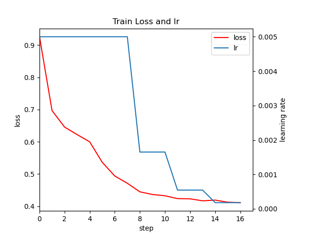
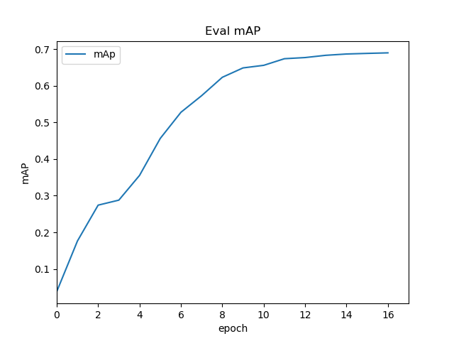

I made a example of Faster R-cnn in the link[https://www.kaggle.com/code/zshiming/faster-r-cnn/edit].
If you want to use this notebook, you should notice the input datasets. I add two datasets,"/kaggle/input/mobilenet-v2/mobilenet_v2.pth" and "/kaggle/input/pascal-voc-2012".
You can add the first dataset in my Dataset, the second in the public dataset PASCAL VOC 2012.

我在Kaggle上实现了一个Faster R-CNN的样例[https://www.kaggle.com/code/zshiming/faster-r-cnn/edit]。
如果想要运行这个notebook，注意添加两个数据集："/kaggle/input/mobilenet-v2/mobilenet_v2.pth""/kaggle/input/pascal-voc-2012"。
第一个是我的数据集中的，第二个是在公共数据集中的PASCAL VOC 2012。

结果:

And here are my visited source links（参考链接）:
1. https://github.com/WZMIAOMIAO/deep-learning-for-image-processing/tree/master/pytorch_object_detection/faster_rcnn

2. https://github.com/pytorch/vision/tree/main/torchvision/models/detection
